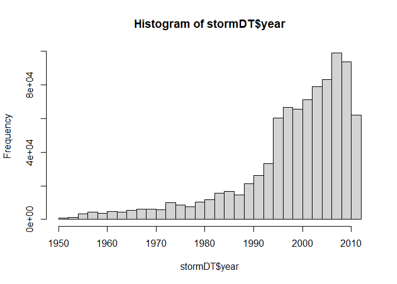
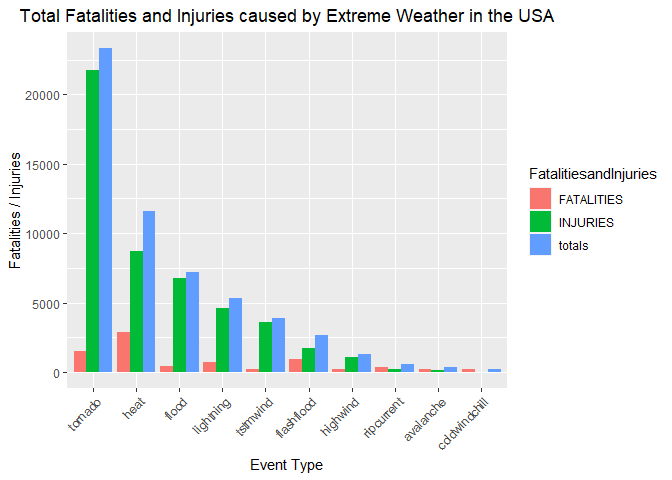
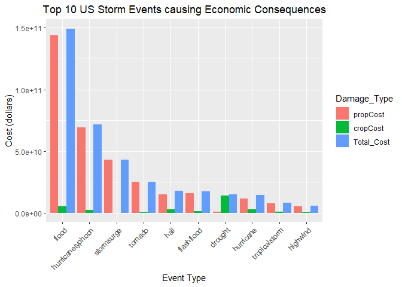

Health and Economic Impact of Weather Events in the US
======================================================


Storms and other severe weather events can cause both public health and economic
problems for communities and municipalities. Many severe events can result in
fatalities, injuries, and property damage, and preventing such outcomes to the extent
possible is a key concern.

This project involves exploring the U.S. National Oceanic and Atmospheric
Administration's (NOAA) storm database. This database tracks characteristics of major
storms and weather events in the United States, including when and where they occur, as
well as estimates of any fatalities, injuries, and property damage.

## 1: Synopsis

The analysis on the storm event database revealed that tornadoes are the most
dangerous weather event to the population health. The second most dangerous
event type is the excessive heat. The economic impact of weather events was
also analyzed. Flash floods and thunderstorm winds caused billions of dollars
in property damages between 1950 and 2011. The largest crop damage caused by
drought, followed by flood and hails.

## 2: Data Processing

The analysis was performed on
[Storm Events Database](http://www.ncdc.noaa.gov/stormevents/ftp.jsp), provided by
[National Climatic Data Center](http://www.ncdc.noaa.gov/). The data is from a comma-separated-value file available
[here](https://d396qusza40orc.cloudfront.net/repdata%2Fdata%2FStormData.csv.bz2).
There is also some documentation of the data available
[here](https://d396qusza40orc.cloudfront.net/repdata%2Fpeer2_doc%2Fpd01016005curr.pdf).

### 2.1: Data Loading

Download the raw data file and extract the data into a dataframe.Then convert to a data.table


```r
url1 = "https://d396qusza40orc.cloudfront.net/repdata%2Fdata%2FStormData.csv.bz2"

destfile <-"StormData.csv.bz"


if(!file.exists("StormData.csv.bz")){
download.file(url1,destfile)
}
stormDF <- read.csv("StormData.csv.bz",header = TRUE)
# str(stormDF)
# head(stormDF)
# colnames(stormDF)

stormDT <- as.data.table(stormDF)
```

### 2.2: Examining Column Names


```r
#colnames(stormDT)
```

### 2.3: Data Subsetting

 

```r
stormDT$year <- as.numeric(format(as.Date(stormDT$BGN_DATE, format = "%m/%d/%Y %H:%M:%S"), "%Y"))
hist(stormDT$year,breaks = 30)
```

<!-- -->

```r
stormDT <- stormDT[stormDT$year >= 1995, ]
dim(stormDT)
```

```
## [1] 681500     38
```

Based on the above histogram, we see that the number of events tracked starts to significantly increase around 1995. So, we use the subset of the data from 1990 to 2011 to get most out of good records.

Subset the dataset on the parameters of interest. Basically, we remove the columns we don't need for clarity.


```r
#colnames(stormDT)
stormDT$EVTYPE <- tolower(stormDT$EVTYPE)
#unique(stormDT$EVTYPE)
length(unique(stormDT$EVTYPE))
```

```
## [1] 716
```

```r
# replace all punct. characters with a space

stormDT$EVTYPE <- gsub("[[:punct:][:blank:]]+", " ", stormDT$EVTYPE)
length(unique(stormDT$EVTYPE))
```

```
## [1] 688
```

```r
stormDT$EVTYPE <- str_replace_all(stormDT$EVTYPE, "early","") 
stormDT$EVTYPE <- str_replace_all(stormDT$EVTYPE, "extreme","") 
stormDT$EVTYPE <- str_replace_all(stormDT$EVTYPE, "excessive","")
stormDT$EVTYPE <- str_replace_all(stormDT$EVTYPE, "gusty","")
stormDT$EVTYPE <- str_replace_all(stormDT$EVTYPE, "monthly","")
stormDT$EVTYPE <- str_replace_all(stormDT$EVTYPE, "record","")
stormDT$EVTYPE <- str_replace_all(stormDT$EVTYPE, "severe","")
stormDT$EVTYPE <- str_replace_all(stormDT$EVTYPE, "unseasonably","")
stormDT$EVTYPE <- str_replace_all(stormDT$EVTYPE, "urban","")
stormDT$EVTYPE <- str_replace_all(stormDT$EVTYPE, " ","") 
stormDT$EVTYPE <- str_replace_all(stormDT$EVTYPE, "/","")
stormDT$EVTYPE[which(grepl("coldairtornado",  stormDT$EVTYPE))] <- "tornado"
stormDT$EVTYPE[which(grepl("frost\freeze", stormDT$EVTYPE))] <- "frost"
length(unique(stormDT$EVTYPE))
```

```
## [1] 617
```

```r
# Finding columns to remove
cols2Remove <- colnames(stormDT[, !c("EVTYPE"
  , "FATALITIES"
  , "INJURIES"
  , "PROPDMG"
  , "PROPDMGEXP"
  , "CROPDMG"
  , "CROPDMGEXP")])
# Removing columns
stormDT[, c(cols2Remove) := NULL]
# Only use data where fatalities or injuries occurred.  
stormDT <- stormDT[(EVTYPE != "?" & 
             (INJURIES > 0 | FATALITIES > 0 | PROPDMG > 0 | CROPDMG > 0)), c("EVTYPE"
                                                                            , "FATALITIES"
                                                                            , "INJURIES"
                                                                            , "PROPDMG"
                                                                            , "PROPDMGEXP"
                                                                            , "CROPDMG"
                                                                            , "CROPDMGEXP") ]
length(unique(stormDT$EVTYPE))
```

```
## [1] 292
```

### 2.4: Converting Exponent Columns into Actual Exponents instead of (-,+, H, K, etc)

Making the PROPDMGEXP and CROPDMGEXP columns cleaner so they can be used to calculate property and crop cost.


```r
# Change all damage exponents to uppercase.
cols <- c("PROPDMGEXP", "CROPDMGEXP")
stormDT[,  (cols) := c(lapply(.SD, toupper)), .SDcols = cols]
# Map property damage alphanumeric exponents to numeric values.
propDmgKey <-  c("\"\"" = 10^0,
                 "-" = 10^0, 
                 "+" = 10^0,
                 "0" = 10^0,
                 "1" = 10^1,
                 "2" = 10^2,
                 "3" = 10^3,
                 "4" = 10^4,
                 "5" = 10^5,
                 "6" = 10^6,
                 "7" = 10^7,
                 "8" = 10^8,
                 "9" = 10^9,
                 "H" = 10^2,
                 "K" = 10^3,
                 "M" = 10^6,
                 "B" = 10^9)
# Map crop damage alphanumeric exponents to numeric values
cropDmgKey <-  c("\"\"" = 10^0,
                "?" = 10^0, 
                "0" = 10^0,
                "K" = 10^3,
                "M" = 10^6,
                "B" = 10^9)
stormDT[, PROPDMGEXP := propDmgKey[as.character(stormDT[,PROPDMGEXP])]]
stormDT[is.na(PROPDMGEXP), PROPDMGEXP := 10^0 ]
stormDT[, CROPDMGEXP := cropDmgKey[as.character(stormDT[,CROPDMGEXP])] ]
stormDT[is.na(CROPDMGEXP), CROPDMGEXP := 10^0 ]
```

### 2.5: Making Economic Cost Columns


```r
stormDT <- stormDT[, .(EVTYPE, FATALITIES, INJURIES, PROPDMG, PROPDMGEXP, propCost = PROPDMG * PROPDMGEXP, CROPDMG, CROPDMGEXP, cropCost = CROPDMG * CROPDMGEXP)]
```

### 2.6: Calcuating Total Property and Crop Cost


```r
totalCostDT <- stormDT[, .(propCost = sum(propCost), cropCost = sum(cropCost), Total_Cost = sum(propCost) + sum(cropCost)), by = .(EVTYPE)]
totalCostDT <- totalCostDT[order(-Total_Cost), ]
totalCostDT <- totalCostDT[1:10, ]
head(totalCostDT, 5)
```

```
##              EVTYPE     propCost   cropCost   Total_Cost
## 1:            flood 144023213557 5422908400 149446121957
## 2: hurricanetyphoon  69305840000 2607872800  71913712800
## 3:       stormsurge  43193536000       5000  43193541000
## 4:          tornado  24935939545  296595770  25232535315
## 5:             hail  15048722103 2614127070  17662849173
```

### 2.7: Calcuating Total Fatalities and Injuries


```r
totalInjuriesDT <- stormDT[, .(FATALITIES = sum(FATALITIES), INJURIES = sum(INJURIES), totals = sum(FATALITIES) + sum(INJURIES)), by = .(EVTYPE)]
totalInjuriesDT <- totalInjuriesDT[order(-FATALITIES), ]
totalInjuriesDT <- totalInjuriesDT[1:10, ]
head(totalInjuriesDT, 5)
```

```
##        EVTYPE FATALITIES INJURIES totals
## 1:       heat       2920     8710  11630
## 2:    tornado       1545    21765  23310
## 3: flashflood        934     1734   2668
## 4:  lightning        730     4631   5361
## 5:      flood        423     6769   7192
```

## 3: Results

### 3.1: Events that are Most Harmful to Population Health

Melting data.table so that it is easier to put in bar graph format 


```r
fiData <- melt(totalInjuriesDT, id.vars="EVTYPE", variable.name = "FatalitiesandInjuries")
head(fiData, 5)
```

```
##        EVTYPE FatalitiesandInjuries value
## 1:       heat            FATALITIES  2920
## 2:    tornado            FATALITIES  1545
## 3: flashflood            FATALITIES   934
## 4:  lightning            FATALITIES   730
## 5:      flood            FATALITIES   423
```

```r
summary(fiData)
```

```
##     EVTYPE          FatalitiesandInjuries     value      
##  Length:30          FATALITIES:10         Min.   :   36  
##  Class :character   INJURIES  :10         1st Qu.:  282  
##  Mode  :character   totals    :10         Median : 1214  
##                                           Mean   : 3773  
##                                           3rd Qu.: 4441  
##                                           Max.   :23310
```


```r
# Create chart
healthChart <- ggplot(fiData, aes(x=reorder(EVTYPE, -value), y=value))
# Plot data as bar chart
healthChart = healthChart + geom_bar(stat="identity", aes(fill=FatalitiesandInjuries), position="dodge")
# Format y-axis scale and set y-axis label
healthChart = healthChart + ylab("Fatalities / Injuries") 
# Set x-axis label
healthChart = healthChart + xlab("Event Type") 
# Rotate x-axis tick labels 
healthChart = healthChart + theme(axis.text.x = element_text(angle=45, hjust=1))
# Set chart title and center it
healthChart = healthChart + ggtitle("Total Fatalities and Injuries caused by Extreme Weather in the USA") + theme(plot.title = element_text(hjust = 0.5))
healthChart
```

<!-- -->

Conclusion:
From all weather types types, tornado’s were most harmful with respect to human health.Heat, flood and Thunderstorms are the weather types that caused the most fatalities and injuries.

### 3.2: Events that have the Greatest Economic Consequences

Melting data.table so that it is easier to put in bar graph format 


```r
econ_consequences <- melt(totalCostDT, id.vars="EVTYPE", variable.name = "Damage_Type")
head(econ_consequences, 5)
```

```
##              EVTYPE Damage_Type        value
## 1:            flood    propCost 144023213557
## 2: hurricanetyphoon    propCost  69305840000
## 3:       stormsurge    propCost  43193536000
## 4:          tornado    propCost  24935939545
## 5:             hail    propCost  15048722103
```


```r
# Create chart
econChart <- ggplot(econ_consequences, aes(x=reorder(EVTYPE, -value), y=value))
# Plot data as bar chart
econChart = econChart + geom_bar(stat="identity", aes(fill=Damage_Type), position="dodge")
# Format y-axis scale and set y-axis label
econChart = econChart + ylab("Cost (dollars)") 
# Set x-axis label
econChart = econChart + xlab("Event Type") 
# Rotate x-axis tick labels 
econChart = econChart + theme(axis.text.x = element_text(angle=45, hjust=1))
# Set chart title and center it
econChart = econChart + ggtitle("Top 10 US Storm Events causing Economic Consequences") + theme(plot.title = element_text(hjust = 0.5))
econChart
```

<!-- -->

Conclusion:
The data shows that floods have caused the most damage, followed by hurricanes, tropical storms, tornados, and hail. Also, the weather seems to cause more property damage than crop damage.But the most severe weather event in terms of crop damage is the drought. Floods and hail also cause significant damage to crops.
